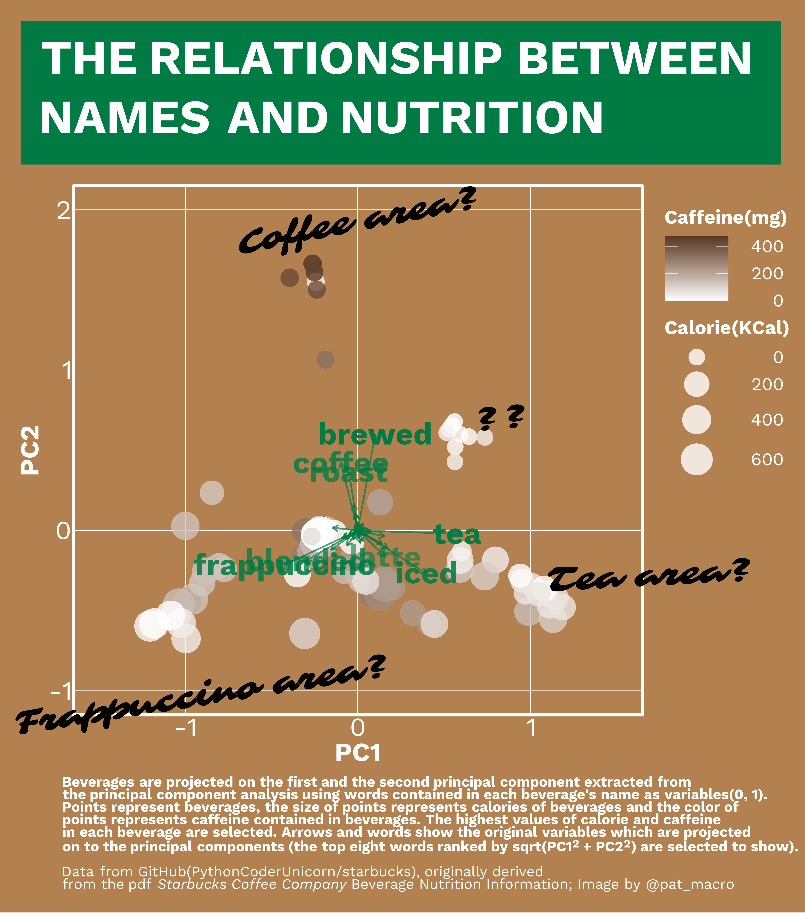

[@pat_macro](https://twitter.com/pat_macro)’s Tidytuesday plot
================

## 2021 Week50([data](https://github.com/rfordatascience/tidytuesday/blob/master/data/2021/2021-12-07/readme.md), [code](https://github.com/ocean-v/my_tidytuesday/blob/main/Week_50_code.r))

## 2021 Week51([data](https://github.com/rfordatascience/tidytuesday/blob/master/data/2021/2021-12-14/readme.md), [code](https://github.com/ocean-v/my_tidytuesday/blob/main/Week_51_code.r))

## 2021 Week52([data](https://github.com/rfordatascience/tidytuesday/blob/master/data/2021/2021-12-21/readme.md), [code](https://github.com/ocean-v/my_tidytuesday/blob/main/Week_52_code.r))

## 2022 Week01([data](), [code](https://github.com/ocean-v/my_tidytuesday/blob/main/2022_Week_01_code.r))

## 2022 Week02([data](https://github.com/rfordatascience/tidytuesday/blob/master/data/2022/2022-01-11/readme.md), [code](https://github.com/ocean-v/my_tidytuesday/blob/main/2022_Week_02_code.r))

## 2022 Week03([data](https://github.com/rfordatascience/tidytuesday/blob/master/data/2022/2022-01-18/readme.md), [code](https://github.com/ocean-v/my_tidytuesday/blob/main/2022_Week_03_code.r))

## 2022 Week04([data](https://github.com/rfordatascience/tidytuesday/blob/master/data/2022/2022-01-25/readme.md), [code](https://github.com/ocean-v/my_tidytuesday/blob/main/2022_Week_04_code.r))

## 2022 Week05([data](https://github.com/rfordatascience/tidytuesday/blob/master/data/2022/2022-02-01/readme.md), [code](https://github.com/ocean-v/my_tidytuesday/blob/main/2022_Week_05_code.r))

## 2022 Week06([data](https://github.com/rfordatascience/tidytuesday/blob/master/data/2022/2022-02-08/readme.md), [code](https://github.com/ocean-v/my_tidytuesday/blob/main/2022_Week_06_code.r))

## 2022 Week07([data](https://github.com/rfordatascience/tidytuesday/blob/master/data/2022/2022-02-15/readme.md), [code](https://github.com/ocean-v/my_tidytuesday/blob/main/2022_Week_07_code.r))

## 2022 Week08([data](https://github.com/rfordatascience/tidytuesday/blob/master/data/2022/2022-02-22/readme.md), [code](https://github.com/ocean-v/my_tidytuesday/blob/main/2022_Week_08_code.r))

## 2022 Week09([data](https://github.com/rfordatascience/tidytuesday/blob/master/data/2022/2022-03-01/readme.md), [code](https://github.com/ocean-v/my_tidytuesday/blob/main/2022_Week_09_code.r))

## 2022 Week10([data](https://github.com/rfordatascience/tidytuesday/blob/master/data/2022/2022-03-08/readme.md), [code](https://github.com/ocean-v/my_tidytuesday/blob/main/2022_Week_10_code.r))

## 2022 Week11([data](https://github.com/rfordatascience/tidytuesday/blob/master/data/2022/2022-03-15/readme.md), [code](https://github.com/ocean-v/my_tidytuesday/blob/main/2022_Week_11_code.r))

## 2022 Week12([data](https://github.com/rfordatascience/tidytuesday/blob/master/data/2022/2022-03-22/readme.md), [code](https://github.com/ocean-v/my_tidytuesday/blob/main/2022_Week_12_code.r))

## 2022 Week13([data](https://github.com/rfordatascience/tidytuesday/blob/master/data/2022/2022-03-29/readme.md), [code](https://github.com/ocean-v/my_tidytuesday/blob/main/2022_Week_13_code.r))

## 2022 Week14([data](https://github.com/rfordatascience/tidytuesday/blob/master/data/2022/2022-04-05/readme.md), [code](https://github.com/ocean-v/my_tidytuesday/blob/main/2022_Week_14_code.r))

